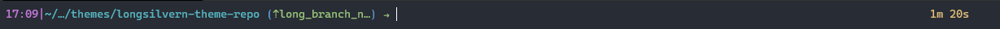
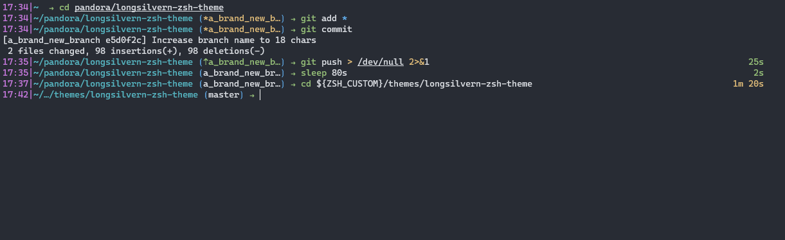

# longsilvern-zsh-theme
A zsh theme that provides you an extra bit functionalities without weighing you down.<br />

<br />

## Features
---
A few quality of life functionalities to enhance your shell experiences:

* __Measured Execution Time__ : Calculate the elapsed time of the previously successful executed command.<br />
  Don't know whether you have enough time to grab a coffee while waiting for the code to compile? Now you do.
* __Condensed Path__ : Got lost in a deep logs folder hierarchy? This will help you find your root and where you currently are.<br />
(Need full path? `pwd` is one command away)
* __Git Prompt__ :
    * __Condensed Branch Name__ : shorten the branch name with > 18 chars long to save space. <br />
    (`git branch` for the full branch name)
    * __Git Status__: Show the status of the current working git repository
        *  ⇡   (Green)  : Current branch is ahead of HEAD
        *  ⇣   (Red)    : Current branch is behind HEAD
        *  \*  (Yellow) : Current branch has uncommitted changes (e.g: modified/added/deleted files)
<br />
<br />

## Installation
---
### Requirement

* [oh-my-zsh](https://ohmyz.sh/#install)

### Instructions
* Clone the repository: 
```bash
git clone https://github.com/long263/longsilvern-zsh-theme.git ${ZSH_CUSTOM}/themes/longsilvern-zsh-theme
```

* Create a symbolic link
```bash
ln -s ${ZSH_CUSTOM}/themes/longsilvern-zsh-theme/longsilvern.zsh-theme ${ZSH_CUSTOM}/themes/longsilvern.zsh-theme
```

* Set theme
```bash
sed -i 's/ZSH_THEME=".*"/ZSH_THEME="longsilvern"/1' ~/.zshrc
```

* Reset shell to take the new change
```bash
source ~/.zshrc
```

## Previews
---
### Windows Subsystem
* Colour theme: [One Half Dark](https://docs.microsoft.com/en-us/windows/terminal/customize-settings/color-schemes#one-half-dark)

